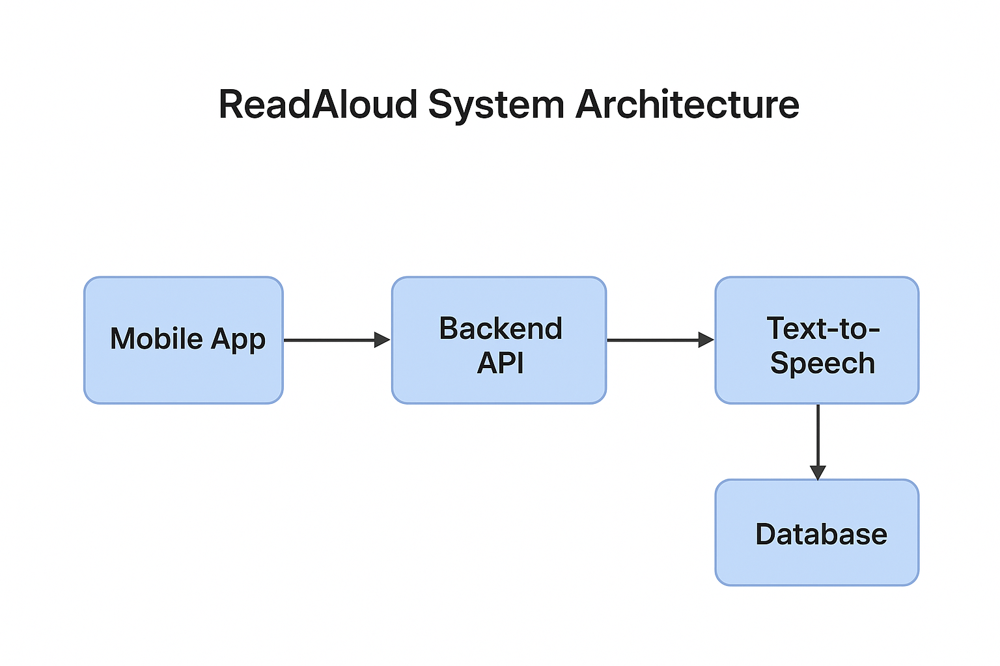

# ReadAloud System Architecture 🧠

This document explains the technical blueprint behind ReadAloud — a cross-platform app that converts text into speech.

---

## 🧩 Technology Stack

| Layer | Technology | Purpose |
|--------|-------------|----------|
| Frontend | React Native | Build iOS + Android app from one codebase |
| Backend | Node.js + Express | API for user requests and file handling |
| Text-to-Speech Engine | Google Cloud TTS / AWS Polly | Convert text to audio |
| Database | Firebase Firestore | Store users, preferences, bookmarks |
| Storage | Firebase Storage | Save uploaded files & generated audio |
| Authentication | Firebase Auth (email + social login) | Secure login |
| Deployment | Firebase Hosting / Vercel | Continuous integration and hosting |

---

## ⚙️ Component Overview

### 1. Frontend
- Handles user interface and navigation.
- Uploads or imports e-books (EPUB, PDF, TXT).
- Sends text content to backend for conversion.
- Streams or downloads resulting audio.

### 2. Backend
- RESTful API built with Express.
- Handles authentication validation.
- Sends text to TTS API and returns audio stream URL.
- Tracks listening progress and metadata.

### 3. TTS Service Integration
- Uses external API (e.g., Google Cloud TTS) to synthesize speech.
- Supports multiple voices and speeds.

### 4. Database & Storage
- **Firestore:** user profiles, library items, preferences.  
- **Storage:** audio files or cached streams.

---

## 🔄 Communication Flow Diagram

---

## 🧱 System Diagram

